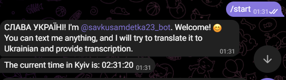
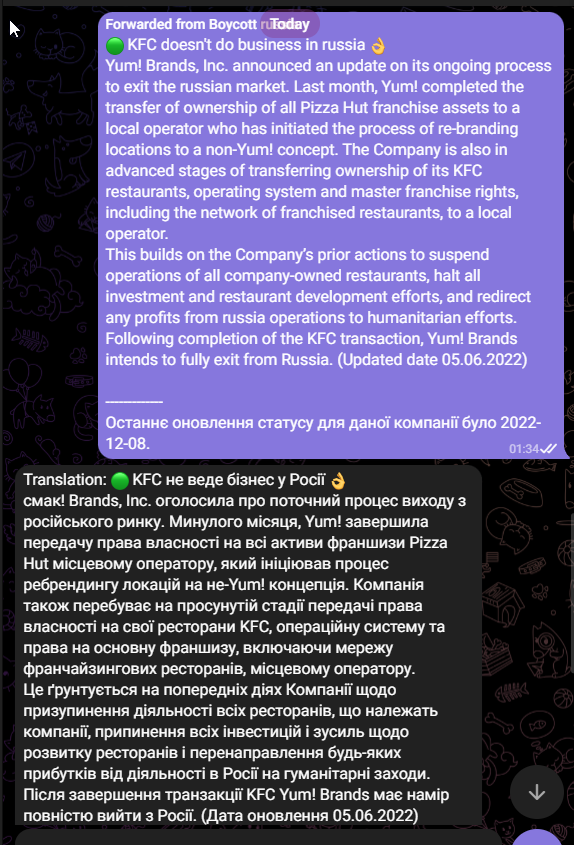
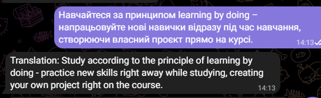

# kbot - devops application from scratch

Hi! This repo is for telegram bot which can translate your messages or forwarded posts to Ukrainian and provide transliteration for it or translate it from Ukrainian to English.

# Tech stack

 - Code: Goland
 - Golang framework for telegram bots-  [**telebot.v3**](https://gopkg.in/telebot.v3)
 - Framework for CLI interfaces: [**cobra**](https://github.com/spf13/cobra)
 - Other packages:
[**gtranslate**](https://github.com/bregydoc/gtranslate),
[**transliteration-go**](https://github.com/fre5h/transliteration-go),
[**language**](https://golang.org/x/text/language).

## Start using

To start using this bot you need to send messages to [**savkusamdetka23_bot**](https://t.me/savkusamdetka23_bot).

### Initialization
Just press start or type `/start`.

### Translate to Ukrainian
After initialization you can start typing or forwarding posts and messages in English to receive a translation in Ukrainian with the transliteration.

### Translate to English
Also you can post or forward messages in Ukrainian to receive tranlation in English.

