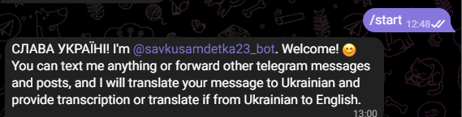
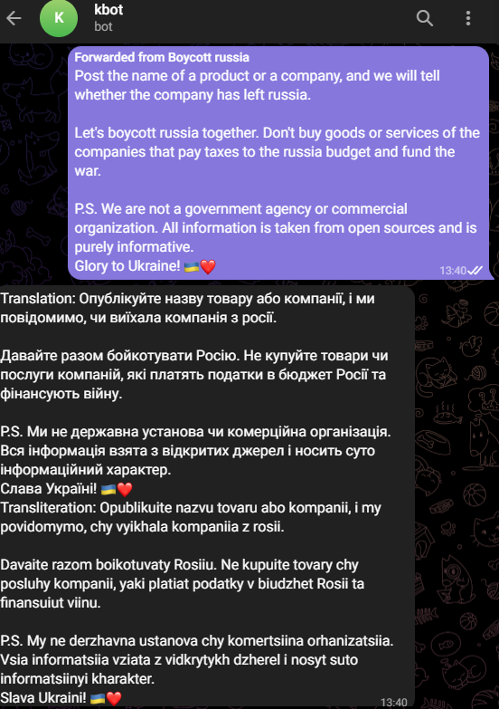
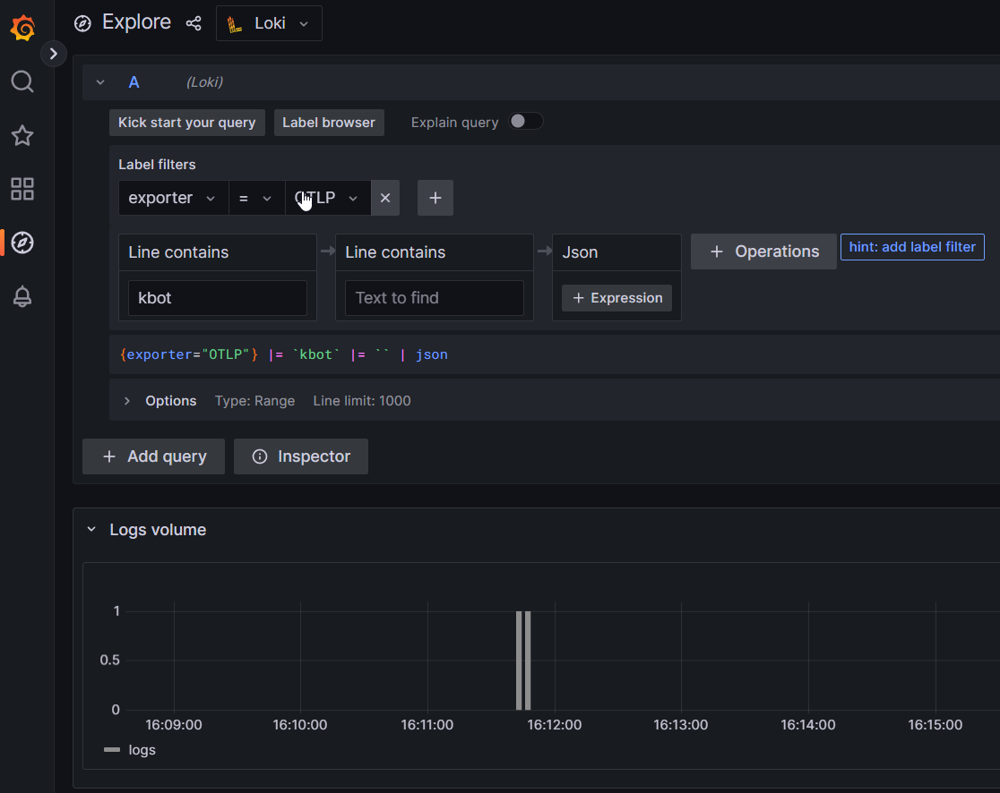

# kbot - devops application from scratch

This telegram bot can translate your messages to Ukrainian and provide transliteration for it.
## To start using this bot you need to send messages to t.me/savkusamdetka23_bot

Just press start and start typing of forwarding posts and messages in English to receive a translation in Ukrainian with the transliteration. 

Also you can post or forward messages in Ukrainian to receive tranlation in English. 
