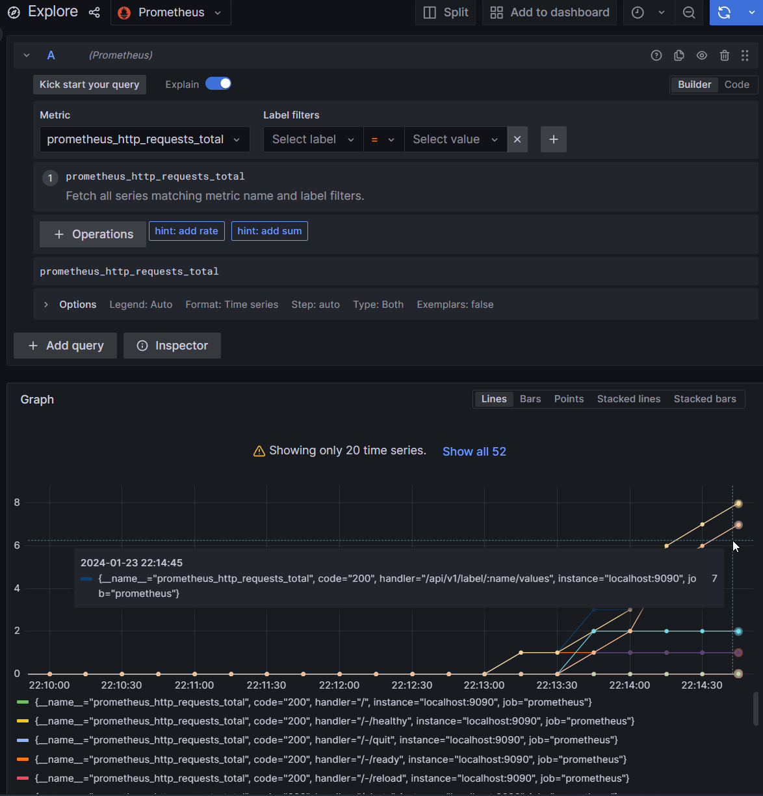
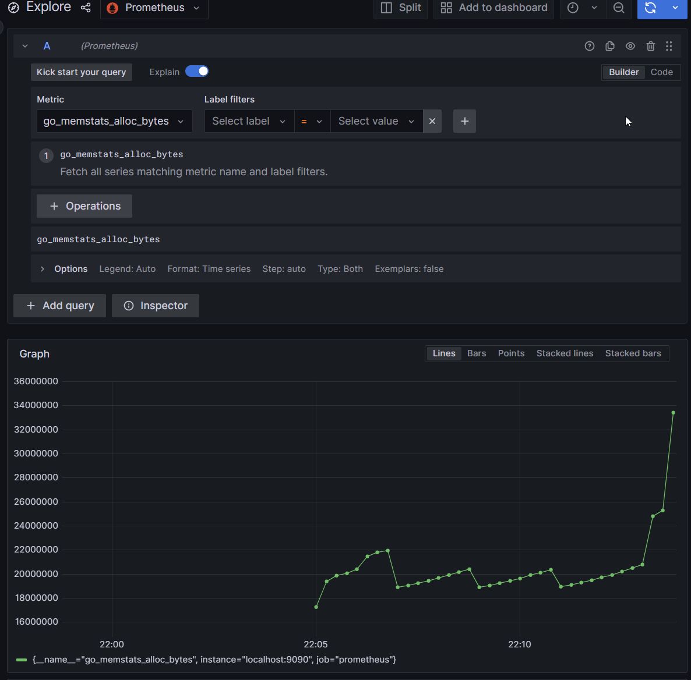
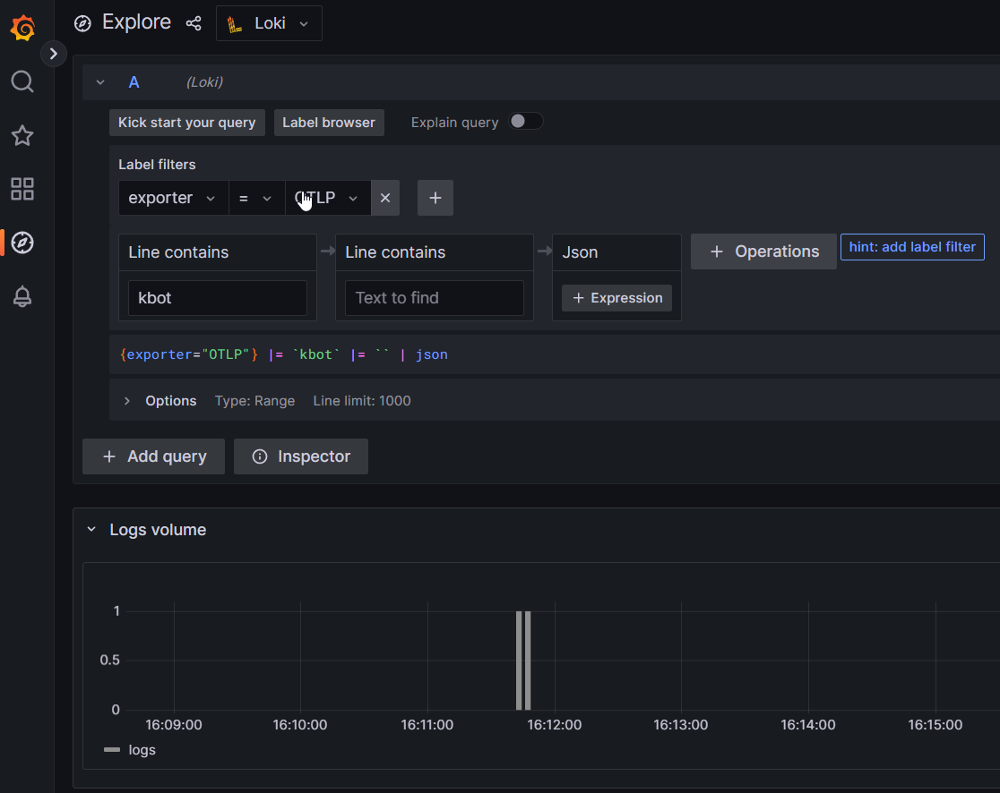
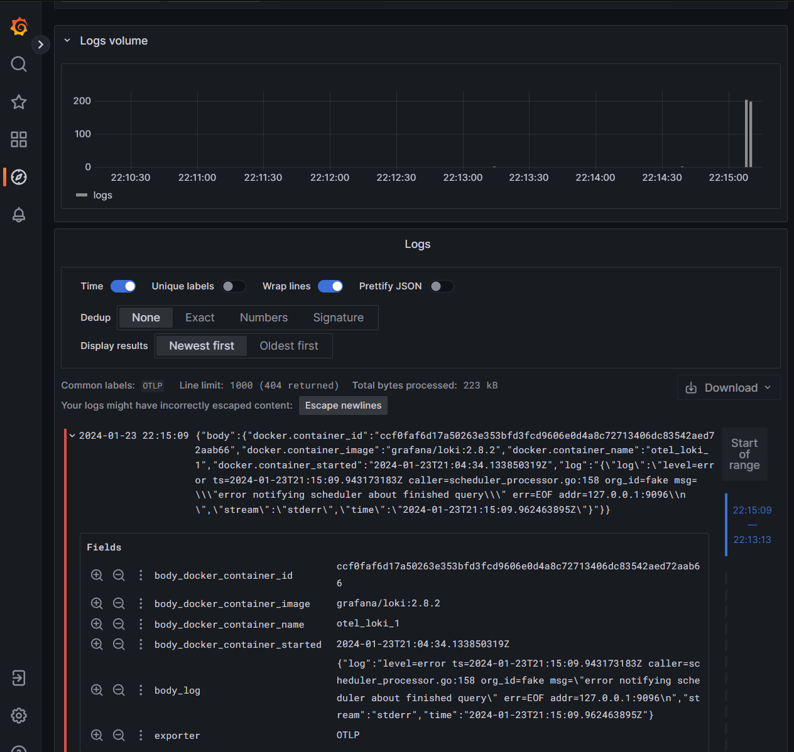

# Open-telemetry observability

Sample configuration for Kbot that send logs to [OpenTelemetry Collector] and metrics to [OpenTelemetry Collector] or [Prometheus].

## Prerequisites

- [Docker]
- [Docker Compose]

## How to run

```bash
export TELE_TOKEN=<TOKEN>
docker-compose -f otel/docker-compose.yaml up 
```
## Examples of Loki and Prometheus charts.
### Total requests on Prometheus


### Memory usage


### Logs


